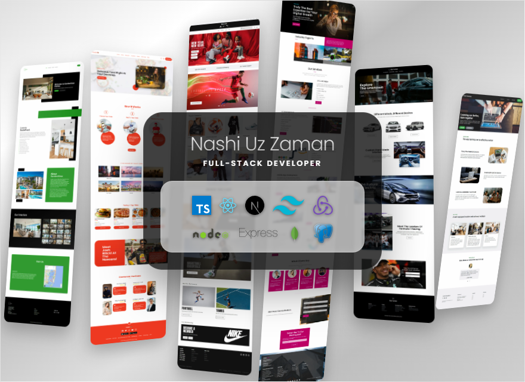

## About Me

Hi, this is Nashiuz Zaman. I am a versatile web developer with expertise in JavaScript, TypeScript, Python and PHP. My skill set includes building dynamic web applications with Next.js, React, and Express.js, backed by MongoDB, MySQL and Firebase Authentication. I specialize in creating visually engaging interfaces using CSS, Tailwind CSS, and Sass, with advanced state management through Redux Toolkit. With proficiency in D3.js, I bring data to life with interactive and compelling visualizations. Additionally, I have experience in web scraping using JavaScript.

🔭 I’m currently working on - Task Managment App

🌱 I’m currently exploring - Python

👯 I’m looking to collaborate on - Fullstack projects

⚡ I'm trying - To acquire deep knowledge of web development

## Current Stats

## My Technologies

  

## Profile Details

    
    

    
    

## Used Languages

<!--
**Nashiuz-Zaman/Nashiuz-Zaman** is a ✨ _special_ ✨ repository because its `README.md` (this file) appears on your GitHub profile.

Here are some ideas to get you started:

- 🔭 I’m currently working on ...
- 🌱 I’m currently learning ...
- 👯 I’m looking to collaborate on ...
- 🤔 I’m looking for help with ...
- 💬 Ask me about ...
- 📫 How to reach me: ...
- 😄 Pronouns: ...
- ⚡ Fun fact: ...
-->
