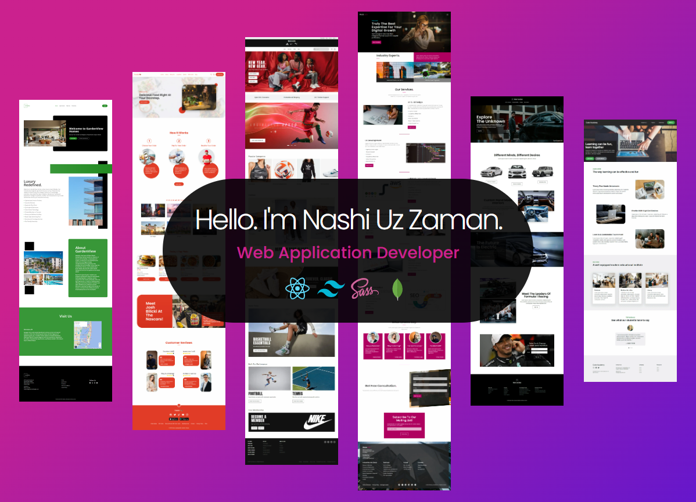

## About Me

Hi, this is Nashiuz Zaman. I'm a Next JS/ React developer who primarily develops fully responsive websites using Next JS, React JS, Redux toolkit, Tanstack Query, Tailwind CSS, Sass, Firebase Authentication, Express JS, MongoDB and Mongoose. I also possess moderate server-side development skills in Vanilla PHP and MySQL. I am comfortable in Object Oriented Programming with both JavaScript and PHP.

🔭 I’m currently working on - Task Managment App

🌱 I’m currently exploring - Next Js, D3.js

👯 I’m looking to collaborate on - Next JS with Express,MongoDB,Mongoose Backend/ MERN Stack projects

⚡ I'm trying - To acquire deep knowledge of web development

## Current Stats

## Used Languages

## My Technologies

  

## Profile Details

<!-- 

    
    

    
    

 -->

<!--
**Nashiuz-Zaman/Nashiuz-Zaman** is a ✨ _special_ ✨ repository because its `README.md` (this file) appears on your GitHub profile.

Here are some ideas to get you started:

- 🔭 I’m currently working on ...
- 🌱 I’m currently learning ...
- 👯 I’m looking to collaborate on ...
- 🤔 I’m looking for help with ...
- 💬 Ask me about ...
- 📫 How to reach me: ...
- 😄 Pronouns: ...
- ⚡ Fun fact: ...
-->
